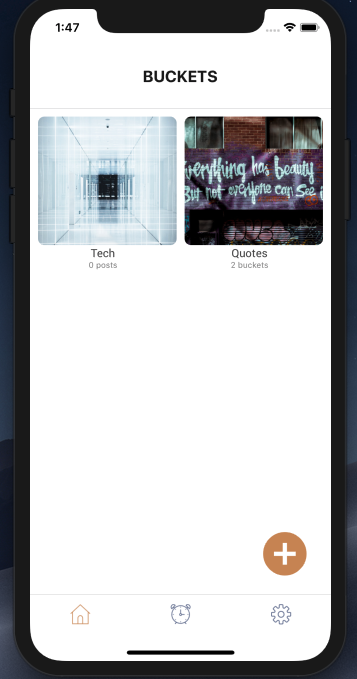
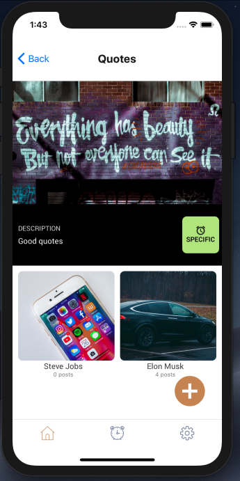
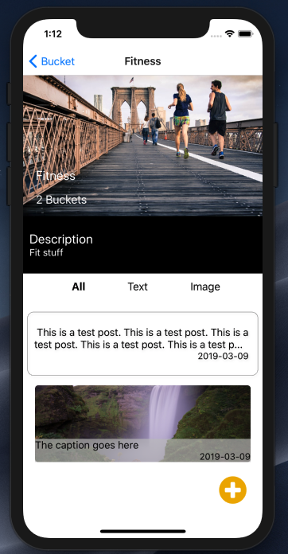
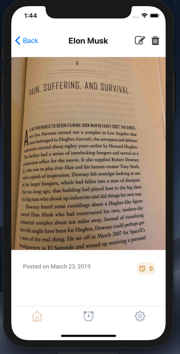

Add `.env` file in root path.

To start server:

`npm start`

--

Micro-service architecture.

Services:

-node.service-notification  
-node.service-reminder  
-node.service-user  

 
-node.service-user - CRUD users, posts, buckets and reminders. Image is stored in Amazon S3 bucket  
-node.service-notification - to send emails through Amazon SES  
-node.service-reminder - to run cron job to find reminders and generate post for reminders  

-
Actual project is private and latest version is private. Demo Images below:
-

