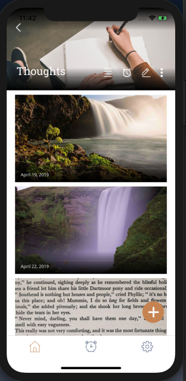

--

App to digitize our book/article highlights and send reminders(weekly, daily, specific)

--

Micro-service architecture.

Services:

-node.service-notification  
-node.service-reminder  
-node.service-user  
-node.service-refer  

 
-node.service-user - CRUD users, posts, buckets and reminders. Image is stored in Amazon S3 bucket  
-node.service-notification - to send emails through Amazon SES  
-node.service-reminder - to run cron job to find reminders and generate post for reminders  
-node.service-reminder - to send refers for 1st release  

-
Actual project is private and latest version is private

Releasing soon!

-

